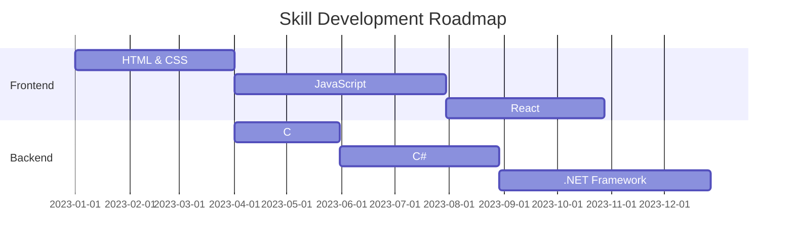

  

  # Dilan | Software Engineer in Training

  
  

## 💼 Professional Summary

Dedicated software engineering student with a passion for creating efficient, scalable solutions. Committed to continuous learning and applying cutting-edge technologies to solve real-world problems.

## 🛠 Tech Stack

  

## 📊 GitHub Analytics

  
  

  

## 🏆 Achievements

  

## 📈 Skill Development

## 🚀 Current Focus

- Advanced JavaScript Concepts
- React and Modern Frontend Frameworks
- Data Structures and Algorithms
- Open Source Contributions

## 📫 Professional Contact

  
  
  

  

